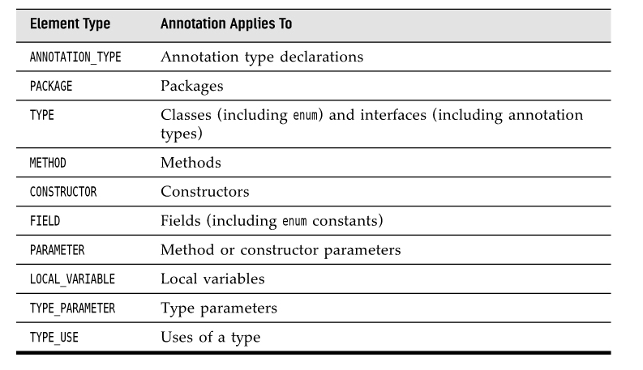
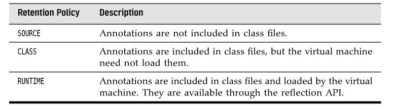

```java
@Target(ElementType.METHOD)
@Retention(RetentionPolicy.RUNTIME)
public @interface Test {
   long timeout() default 0L;
}
```

All annotation interfaces implicitly extend the java.lang.annotation.Annotation inter-face.

```java
public @interface BugReport{

   enum Status { UNCONFIRMED, CONFIRMED, FIXED, NOTABUG };
   boolean showStopper() default false;
   String assignedTo() default "[none]";
   Class<?> testCase() default Void.class;
   Status status() default Status.UNCONFIRMED;
   Reference ref() default @Reference(); // an annotation type
   String[] reportedBy();
}
```

If an element has the special name value and no other element is specified, you can omit the element name and the = symbol
If the author of an annotation declared it to be repeatable, you can repeat the same annotation multiple times:

```java
@BugReport(showStopper=true, reportedBy="Joe")
@BugReport(reportedBy={"Harry", "Carl"})
public void checkRandomInsertions()
```

An annotation element can never be set to null. Not even a default of null is permissible. This can be rather inconvenient in practice.
You will need to find other defaults, such as "" or Void.class.

It is an error to introduce circular dependencies in annotations. For example, BugReport has an element of the annotation type Reference, therefore Reference cannot have an element of type BugReport.


-----
#### Table 8.3 Element Types for the @Target Annotation




#### Retention Policies for the @Retention Annotation




-----

The @Documented meta-annotation gives a hint to documentation tools such as Javadoc.

It is legal to apply an annotation to itself. For example, the @Documented annotation is itself annotated as @Documented. Therefore, the Javadoc documentation for annotations shows whether they are documented.

```java
@Documented
@Target(ElementType.METHOD)
@Retention(RetentionPolicy.RUNTIME)
public @interface ActionListenerFor”

```


The @Inherited meta-annotation applies only to annotations for classes. When a class has an inherited annotation, then all of its subclasses automatically have the same annotation.

```java
@Inherited @interface Persistent { }
```

As of Java 8, it is legal to apply the same annotation type multiple times to an item. For backward compatibility, the implementor of a repeatable annotation needs to provide a container annotation that holds the repeated annotations in an array.

Here is how to define the @TestCase annotation and its container:


```java
@Repeatable(TestCases.class)
@interface TestCase
{
   String params();
   String expected();
}

@interface TestCases
{
   TestCase[] value();
}
```

Whenever the user supplies two or more @TestCase annotations, they are automatically wrapped into a @TestCases annotation.
