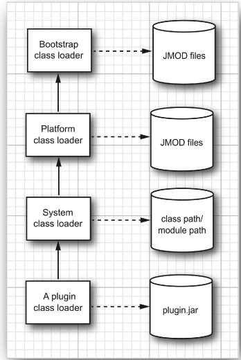
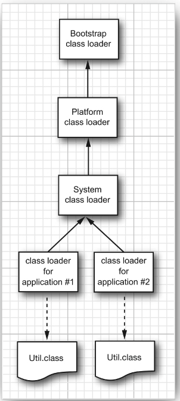

- The bootstrap class loader
- The platform class loader
- The system class loader (sometimes called the application class loader)



```java
var url = new URL("file:///path/to/plugin.jar");
var pluginLoader = new URLClassLoader(new URL[] { url });
Class<?> cl = pluginLoader.loadClass("mypackage.MyClass");”
```

However, you can set any class loader by calling

```java
Thread t = Thread.currentThread();
t.setContextClassLoader(loader);

Thread t = Thread.currentThread();
ClassLoader loader = t.getContextClassLoader();
Class<?> cl = loader.loadClass(className);


```


### Two class loaders load different classes with the same name.




### API

- java.lang.Class
    - ClassLoader getClassLoader() gets the class loader that loaded this class.
- java.lang.ClassLoader
    - ClassLoader getParent() returns the parent class loader, or null if the parent class loader is the bootstrap class loader.
    - static ClassLoader getSystemClassLoader() gets the system class loader—that is, the class loader that was used to load the first application class.
    - protected Class findClass(String name) should be overridden by a class loader to find the bytecodes for a class and present them to the virtual machine by calling the defineClass method. In the name of the class, use . as package name separator, and don’t use a .class suffix.
    - Class defineClass(String name, byte[] byteCodeData, int offset, int length) adds a new class to the virtual machine whose bytecodes are provided in the given data range.

----

- java.net.URLClassLoader
    - URLClassLoader(URL[] urls)
    - URLClassLoader(URL[] urls, ClassLoader parent)
    
construct a class loader that loads classes from the given URLs. If the URL ends in a /, it is assumed to be a directory, otherwise it is assumed to be a JAR file.

----

- java.lang.Thread 
    - ClassLoader getContextClassLoader() gets the class loader that the creator of this thread has designated as the most reasonable class loader to use when executing this thread.
    - void setContextClassLoader(ClassLoader loader) 1.2 sets a class loader for code in this thread to retrieve for loading classes. If no context class loader is set explicitly when a thread is started, the parent’s context class loader is used.


### Writing Your Own Class Loader

- Load the bytecodes for the class from the local file system or some other source.
- Call the defineClass method of the ClassLoader superclass to present the bytecodes to the virtual machine.

- public abstract class ClassLoader 

```java
public class CryptoClassLoader extends ClassLoader {

    private int key;

    public CryptoClassLoader(int key) {
        this.key = key;
    }


    @Override
    protected Class<?> findClass(String moduleName, String name) {
        try {
            byte[] classBytes = null;
            classBytes = loadClassBytes(name);
            Class<?> cl = defineClass(name, classBytes, 0, classBytes.length);
            if (cl == null) {
                throw new ClassNotFoundException(name);
            }
            return cl;
        } catch (IOException | ClassNotFoundException e) {
            e.printStackTrace();
        }
    }

    private byte[] loadClassBytes(String name) throws IOException {
        String cname = name.replace('.', '/') + ".caesar";
        byte[] bytes = Files.readAllBytes(Path.of(cname));
        for (int i = 0; i < bytes.length; ++i) {
            bytes[i] = (byte) (bytes[i] - key);
        }
        return bytes;
    }


    public static void loadClass(String name, String key) {
        try {
            var loader = new CryptoClassLoader(Integer.parseInt(key));
            Class<?> c = loader.loadClass(name);
            Method m = c.getMethod("main", String[].class);
            m.invoke(null, (Object) new String[]{});
        } catch (Throwable e) {
            e.printStackTrace();
        }

    }
}
```