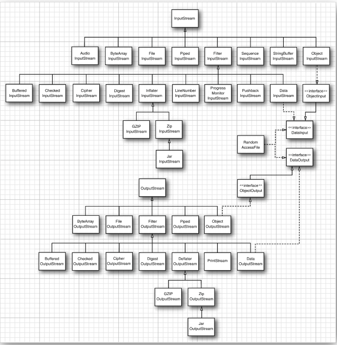
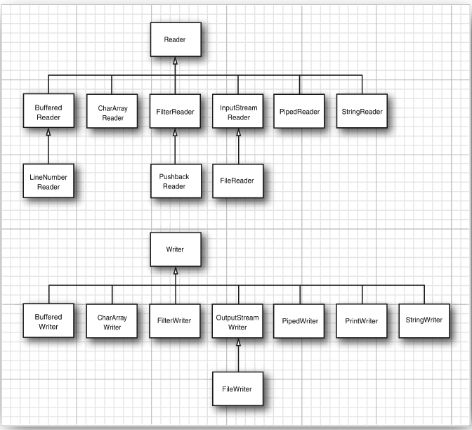
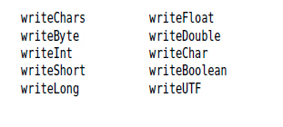
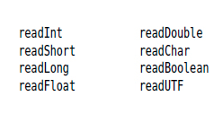

The abstract classes InputStream and OutputStream are the basis for a hierarchy of input/output (I/O) classes.


Byte-oriented input/output streams are inconvenient for processing information stored in Unicode (recall that Unicode uses multiple bytes per character). Therefore, a separate hierarchy provides classes, inheriting from the abstract Reader and Writer classes, for processing Unicode characters. These classes have read and write operations that are based on two-byte char values (that is, UTF-16 code units) rather than byte values.

The transferTo method transfers all bytes from an input stream to an output stream: in.transferTo(out);

Both the read and write methods block until the byte is actually read or written
This means that if the input stream cannot immediately be accessed (usually because of a busy network connection),
the current thread blocks. This gives other threads the chance to do useful work while the method is waiting for the 
input stream to become available again.

Closing an output stream also flushes the buffer used for the output stream: Any bytes that were temporarily placed in a buffer so that they could be delivered as a larger packet are sent off”




For Unicode text, on the other hand, you can use subclasses of the abstract classes Reader and Writer. The basic methods of the Reader and Writer classes are similar to those of InputStream and OutputStream.

- abstract int read()
- abstract void write(int c)



There are four additional interfaces: Closeable, Flushable, Readable, and Appendable
The classes InputStream, OutputStream, Reader, and Writer all implement the Closeable interface.

The java.io.Closeable interface extends the java.lang.AutoCloseable interface. Therefore, you can use the try-with-resources 
statement with any Closeable. Why have two interfaces? The close method of the Closeable interface only throws an IOException,
whereas the AutoCloseable.close method may throw any exception.

```java
java.io.File.separator
System.getProperty("user.dir").

DataInputStream din = . . .
double x = din.readDouble();

But just as the FileInputStream has no methods to read numeric types, the DataInputStream has no method to get data from a file.

var fin = new FileInputStream("employee.dat");
var din = new DataInputStream(fin);
double x = din.readDouble();


var din = new DataInputStream(
   new BufferedInputStream(
      new FileInputStream("employee.dat")));


var in = new InputStreamReader(new FileInputStream("data.txt"), StandardCharsets.UTF_8);
```


#### The DataOutput interface defines the following methods for writing a number, a character, a boolean value, or a string in binary format:



To read the data back in, use the following methods defined in the DataInput interface:




```java
var in = new DataInputStream(new FileInputStream("employee.dat"));
```


###Zip

ZIP archives store one or more files in a (usually) compressed format. Each ZIP archive has a header with information 
such as the name of each file and the compression method that was used. In Java, you can use a ZipInputStream to read a 
ZIP archive. You need to look at the individual entries in the archive. The getNextEntry method returns an object of type ZipEntry that describes the entry. 

---- 

To write a ZIP file, use a ZipOutputStream. For each entry that you want to place into the ZIP file, create a ZipEntry object. Pass the file name to the ZipEntry

constructor; it sets the other parameters such as file date and decompression method. You can override these settings if you like. Then, call the putNextEntry method of the ZipOutputStream to begin writing a new file. Send the file data to the ZIP output stream. When done, call closeEntry. Repeat for all the files you want to store.

----

JAR files are simply ZIP files with a special entry—the so-called manifest. Use the JarInputStream and JarOutputStream classes to read and write the manifest entry.”

### Saving and Loading Serializable Objects

```java
var out = new ObjectOutputStream(new FileOutputStream("employee.dat"));

var harry = new Employee("Harry Hacker", 50000, 1989, 10, 1);
var boss = new Manager("Carl Cracker", 80000, 1987, 12, 15);

out.writeObject(harry);
out.writeObject(boss);


```

There is, however, one change you need to make to any class that you want to save to an output stream and restore from 
an object input stream. The class must implement the Serializable interface:


---

The serialization mechanism provides a way for individual classes to customize default read and write behavior. A serializable class can define methods with the signature

```java
@Serial private void readObject(ObjectInputStream in) throws IOException, ClassNotFoundException;

@Serial private void writeObject(ObjectOutputStream out) throws IOException;

```

Note the @Serial annotation. The methods for tweaking serialization don’t belong to interfaces. Therefore, you can’t use
the @Override annotation to have the compiler check the method declarations. The @Serial annotation is meant to enable 
the same checking for serialization methods. Up to Java 17, the javac compiler doesn’t do such checking, but that might 
change in the future. The IntelliJ IDE uses the annotation.

---
Instead of letting the serialization mechanism save and restore object data, a class can define its own mechanism. To do this, a class must implement the Externalizable interface. This, in turn, requires it to define two methods:”


```java
public void readExternal(ObjectInput in) throws IOException, ClassNotFoundException;
public void writeExternal(ObjectOutput out) throws IOException;
```

Unlike the readObject and writeObject methods, these methods are fully responsible for saving and restoring the entire object, including the superclass data. When writing an object, the serialization mechanism merely records the class of the object in the output stream. When reading an externalizable object, the object input stream creates an object with the no-argument constructor and then calls the readExternal method.

Unlike the readObject and writeObject methods, which are private and can only be called by the serialization mechanism, the readExternal and writeExternal methods are public. In particular, readExternal potentially permits modification of the state of an existing object.

You cannot customize the serialization of enumerations and records. If you define readObject/writeObject or readExternal/writeExternal methods, they are not used for serialization.


You can solve this problem with another special serialization method, called readResolve. If the readResolve method is 
defined, it is called after the object is deserialized. It must return an object which then becomes the return value of the readObject method

The writeReplace produces an object to be written to the object stream instead of the current one. The replacement object 
must be serializable or externalizable. When reading the object stream, the replacement object is deserialized and its readResolve method is called to recreate the original object.”


Unlike the readObject and writeObject methods, which must be private, or the readExternal/writeExternal methods, which 
must be public, the readResolve and writeReplace methods can have any access modifier.”

```java
@Serial public static final long serialVersionUID = 8367346051156850807L;
```

Enumerations and records ignore the serialVersionUID field. An enumeration always has a serialVersionUID of 0L. You can declare the serialVersionUID of a record, but the IDs don’t have to match for deserialization.”


There is an amusing use for the serialization mechanism: It gives you an easy way to clone an object, provided the class is serializable. Simply serialize it to an output stream and then read it back in. The result is a new object that is a deep copy of the existing object. You don’t have to write the object to a file—you can use a ByteArrayOutputStream to save the data into a byte array.

During deserialization of a serializable class, objects are created without invoking any constructor of the class. Even if the class has a no-argument constructor, it is not used. The field values are set directly from the values of the object input stream.


A serializable class can optionally implement the ObjectInputValidation interface and define a validateObject method to check whether its objects are properly deserialized.

Unfortunately, the method is not invoked automatically. To invoke it, you must also provide the following method:

```java
public void validateObject() throws InvalidObjectException{
   System.out.println("validateObject");
   if (salary < 0)
      throw new InvalidObjectException("salary < 0");
}

@Serial private void readObject(ObjectInputStream in)
      throws IOException, ClassNotFoundException {
   in.registerValidation(this, 0);
   in.defaultReadObject();
}
```

The object is then scheduled for validation, and the validateObject method is called when this object and all dependent objects have been loaded. The second parameter lets you specify a priority. Validation requests with higher priorities are done first.


      


