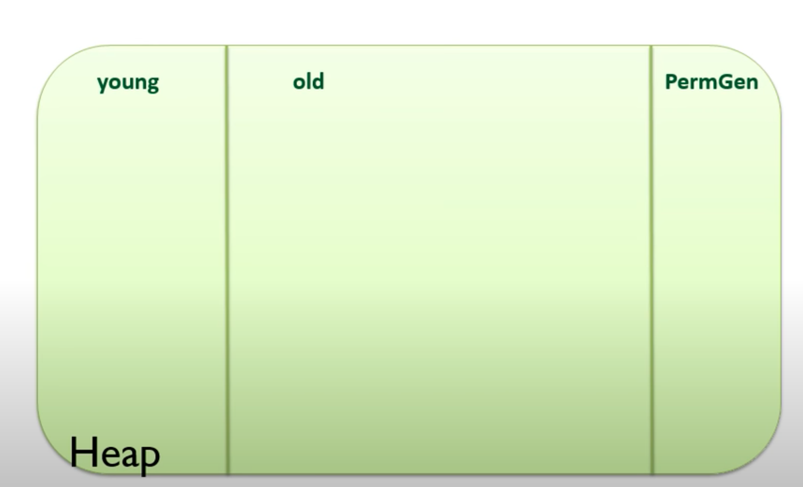
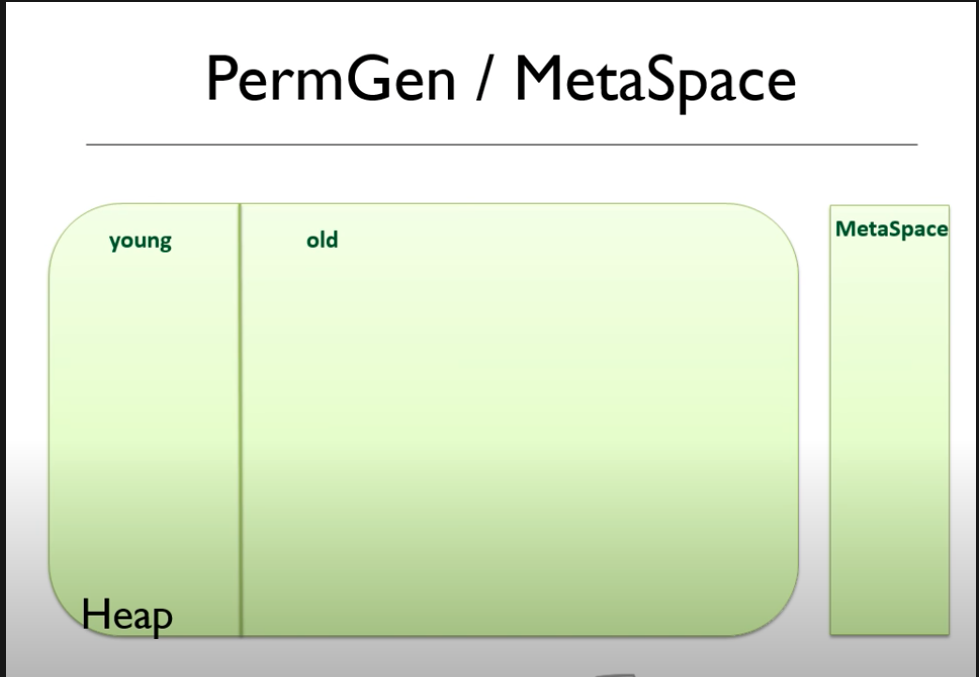
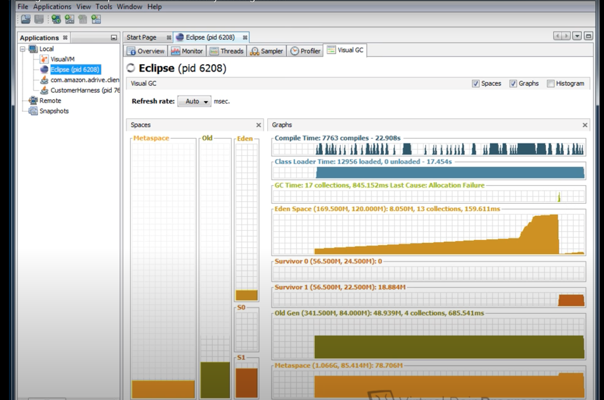

- java visualvm
- heap dump
- Eclipse Memory Analyzer  

- -Xmx set the maximum heap size. example -Xmx512m
- -Xms set the starting heap size. example -Xms256m
- -XX:MaxPermSize set the size of the permgen 
- -verbose:gc print to the console when a garbage collection takes place
- -Xmn set the size of the young generation
- -XX:HeapDupmOnOutOfMemory creatres a heap dump file

## Types of collector

- Serial use single threade -XX:+UseSerialGC
- Paraller  -XX:+UseParallelGC
- Mostly Concurrent not pushe app when gc work
    - -XX:+UseConcMarkSweepGC
    - -XX:+UseG1GC

Use  to find out which is your default GC

## befor java 8

----
## After java 8

----

