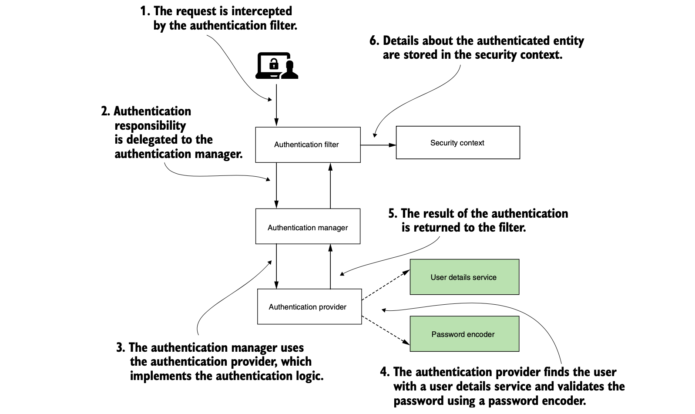
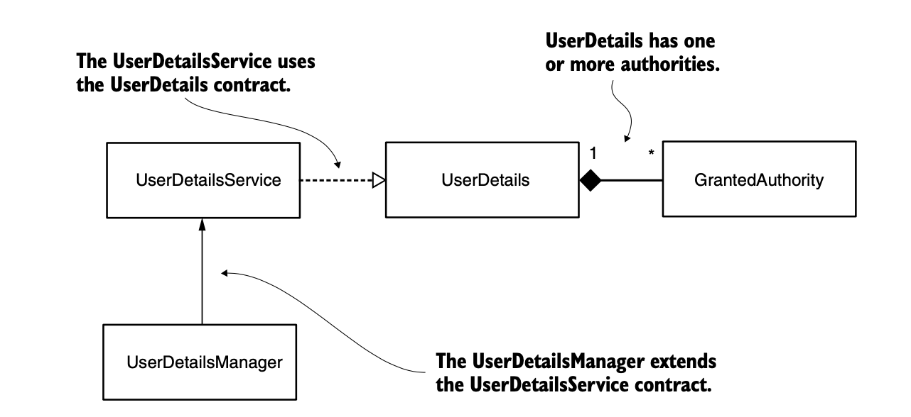

## Dependencies between the components involved in user management. 




## UserDetails

```java
public interface UserDetails extends Serializable {
    String getUsername();
    String getPassword();
    Collection<? extends GrantedAuthority> ➥getAuthorities();
    boolean isAccountNonExpired();
    boolean isAccountNonLocked();
    boolean isCredentialsNonExpired(); boolean isEnabled();
}
```


### Understanding the UserDetailsService contract

```java
public interface UserDetailsService {
  UserDetails loadUserByUsername(String username)
      throws UsernameNotFoundException;
}
```

### Implementing the UserDetailsManager contract


JdbcUserDetailsManager


```java
public interface UserDetailsManager extends UserDetailsService { void createUser(UserDetails user);
    void updateUser(UserDetails user);
    void deleteUser(String username);
    void changePassword(String oldPassword, String newPassword);
  boolean userExists(String username);
}
```

### PasswordEncoder

```java
public interface PasswordEncoder {
    String encode(CharSequence rawPassword);
    boolean matches(CharSequence rawPassword, String encodedPassword);
    default boolean upgradeEncoding(String encodedPassword) { 
        return false;
    } 
}

```

### Authentication

```java
public interface Authentication extends Principal, Serializable {
    Collection<? extends GrantedAuthority> getAuthorities(); Object getCredentials();
    Object getDetails();
    Object getPrincipal();
  boolean isAuthenticated();
  void setAuthenticated(boolean isAuthenticated) throws IllegalArgumentException;
}
```